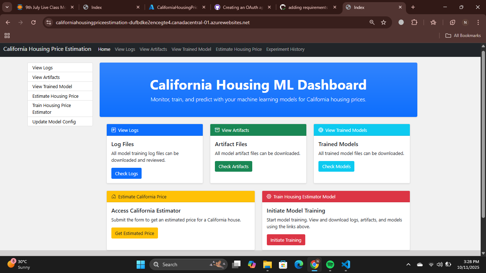
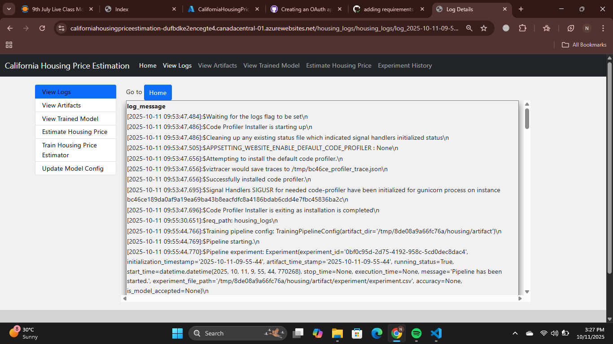
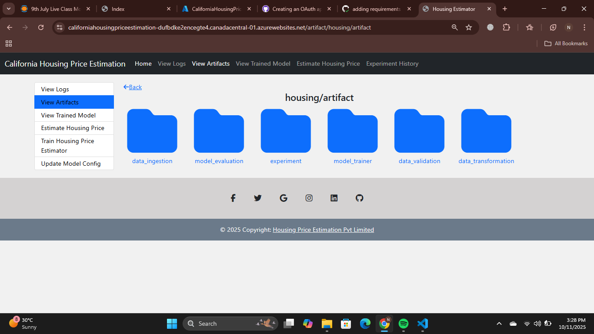
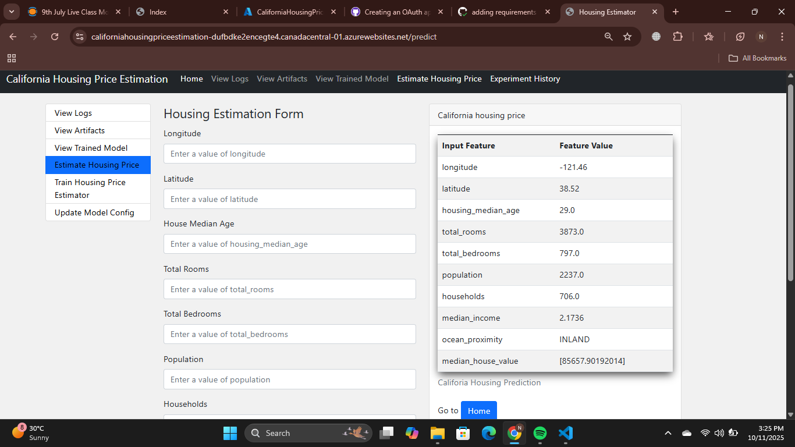

# California Housing ML Project
https://house-price-prediction.tech

This is a small end‑to‑end ML project for the California Housing dataset. It has a simple training pipeline (ingestion → validation → transformation → training → evaluation → pusher) and a Flask app to trigger training, browse artifacts/logs, and make predictions.

## Project structure
- app.py: Flask web app
- config/: model.yaml (models + grid search), schema.yaml (data schema)
- housing/: code for components, configs, entities, pipeline, utils, logs, exceptions
- templates/: Flask HTML templates
- saved_models/: exported models (created at runtime)
- housing_logs/: log files (created at runtime)

## Setup (Windows, Conda)
```powershell
conda create -n basic_ml python=3.11 -y
conda activate basic_ml
python -m pip install --upgrade pip setuptools wheel
pip install -e .
pip install -r requirements.txt
```
In VS Code: use “Python: Select Interpreter” and pick the basic_ml env.

## Run the web app
```powershell
python app.py
```
Open http://localhost:5000/ in your browser.
Useful routes: /train, /predict, /logs, /artifact, /saved_models

## Configuration
- config/model.yaml controls GridSearchCV and candidate models.
- config/schema.yaml defines columns, dtypes, and the target column.

## Artifacts
- data_ingestion: raw/extracted and train/test data
- data_validation: schema checks and drift reports (JSON/HTML)
- data_transformation: processed data and transformers
- model_trainer, model_evaluation, model_pusher: models and metrics
- saved_models/: best/serving model copies

## Troubleshooting (quick)
- ModuleNotFoundError: run `pip install -e .` from the project root.
- KeyError 'grid_search': check config/model.yaml has a top‑level grid_search.
- Few logs: check the newest file in housing_logs/ and ensure the pipeline steps are called.

## Output Screenshots
### Home page

### Logs view

### Artifacts

### Predict

